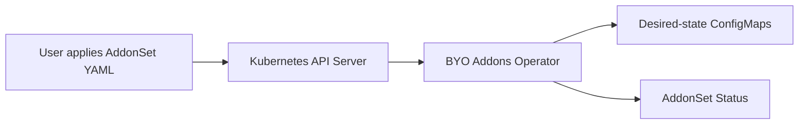
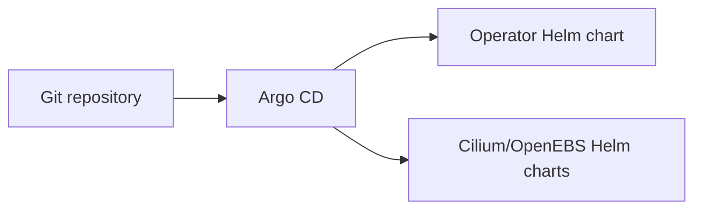

# Bring Your Own Addons

BYO Addons is a simple Kubernetes operator project. It introduces a custom resource called `AddonSet` where a platform engineer can describe which cluster addons should exist, such as a CNI and CSI provider.

The current version does not install real addon Helm charts automatically. It records the desired addon configuration as Kubernetes `ConfigMap` objects and updates `AddonSet.status`. This keeps the project small enough to explain clearly in an interview.

## Tech Stack

- Go
- Kubebuilder-style operator layout
- controller-runtime
- Kubernetes CRDs
- Kubernetes RBAC
- Kustomize
- Helm
- Docker
- Optional Argo CD GitOps examples

## What Problem It Solves

Kubernetes clusters need common platform addons before application workloads can run properly:

- CNI for networking, for example Cilium
- CSI for storage, for example OpenEBS

Without a consistent process, every cluster can be configured differently. This project creates a declarative contract called `AddonSet` so a cluster owner can describe the expected addon stack in one YAML file.

In this version, the operator records that desired state and reports reconciliation status. A future version could use that recorded state to generate Argo CD `Application` resources or install Helm charts directly.

## What The Project Does

- Defines an `AddonSet` Custom Resource Definition.
- Runs a controller manager inside Kubernetes.
- Watches `AddonSet` resources.
- Adds a finalizer so cleanup can happen before deletion.
- Creates one desired-state `ConfigMap` per enabled addon component.
- Updates `AddonSet.status` with desired and ready component counts.
- Provides Kustomize manifests for local/operator deployment.
- Provides a Helm chart for packaged installation.
- Provides optional Argo CD examples for GitOps-style installation.

## What The Project Does Not Do Yet

- It does not create a Kubernetes cluster.
- It does not directly install Cilium or OpenEBS.
- It does not generate Argo CD `Application` resources from `AddonSet`.
- It does not perform real health checks on CNI/CSI workloads.

## Simple Architecture



Optional GitOps example:



## How I Set It Up From Scratch

If an interviewer asks how you created the project, explain this flow.

### 1. Scaffolding With Kubebuilder

This project follows the structure Kubebuilder creates for an operator:

```text
api/                  API type definitions
cmd/                  controller manager entrypoint
internal/controller/  reconciliation logic
config/               CRD, RBAC, manager, and sample YAML
```

The equivalent starting commands are:

```bash
kubebuilder init --domain byoaddons.io --repo github.com/example/byo-addons
kubebuilder create api --group platform --version v1alpha1 --kind AddonSet
```

What Kubebuilder gives us:

- standard operator project structure
- API type files
- controller files
- CRD generation setup
- RBAC marker support
- manager bootstrap code
- Kustomize-based config layout

After scaffolding, the real work is editing the API type and the controller.

### 2. Defining The Custom API

Main file:

```text
api/v1alpha1/addonset_types.go
```

This file defines the custom resource schema.

Important types:

- `AddonSetSpec`: desired state
- `AddonComponent`: one addon, such as Cilium or OpenEBS
- `AddonSource`: where the addon would come from, usually a Helm repo/chart
- `AddonSetStatus`: observed state written by the operator
- `AddonComponentStatus`: status of each component

Important fields:

- `spec.clusterName`: logical cluster name, for example `dev-kind`
- `spec.gitOpsEngine`: custom project field, for example `ArgoCD`, `Flux`, or `None`
- `spec.components`: list of desired addons

`spec.gitOpsEngine` is not a Kubernetes built-in field. It is defined by this project to record which external GitOps engine is expected to apply addon manifests in a future/optional flow.

### 3. Generating The CRD

Kubebuilder/controller-gen generates:

```text
config/crd/bases/platform.byoaddons.io_addonsets.yaml
```

This CRD teaches Kubernetes about:

```yaml
apiVersion: platform.byoaddons.io/v1alpha1
kind: AddonSet
```

After the CRD is installed, these commands work:

```bash
kubectl get addonsets
kubectl get aset
```

`aset` is the short name configured in the API markers.

### 4. Implementing The Controller Manager

Main file:

```text
cmd/main.go
```

This starts the operator process. It:

- creates the runtime scheme
- registers Kubernetes built-in APIs
- registers the `AddonSet` API
- creates the controller-runtime manager
- configures health/readiness probes
- configures the metrics endpoint
- enables leader election when requested
- registers the `AddonSetReconciler`

### 5. Implementing Reconciliation

Main file:

```text
internal/controller/addonset_controller.go
```

Reconciliation flow:

1. Kubernetes sends a request when an `AddonSet` is created, updated, or deleted.
2. The controller fetches the `AddonSet`.
3. If it is not being deleted, the controller adds a finalizer.
4. If it is being deleted, the controller deletes owned desired-state `ConfigMap`s and removes the finalizer.
5. The controller loops through `spec.components`.
6. Disabled components are skipped.
7. Enabled components are written into desired-state `ConfigMap`s.
8. The controller updates `AddonSet.status`.

This is idempotent. Running the same reconcile loop many times should lead to the same cluster state.

## What The Operator Creates In ConfigMaps

Sample file:

```text
config/samples/platform_v1alpha1_addonset.yaml
```

It creates an `AddonSet` named:

```text
baseline-oss
```

Meaning:

- `baseline`: default starting addon set
- `oss`: open source software

The sample has two components:

- `cilium`, type `CNI`
- `openebs-localpv`, type `CSI`

For the Cilium component, the operator creates a ConfigMap named:

```text
baseline-oss-cilium-desired
```

The ConfigMap contains:

- `addon.json`: JSON version of the component spec
- `engine`: value of `spec.gitOpsEngine`, for example `ArgoCD`
- `cluster`: value of `spec.clusterName`, for example `dev-kind`

This ConfigMap is a desired-state record. It says:

> "For cluster `dev-kind`, this addon stack wants Cilium with these source and values."

It does not install Cilium.

## Finalizer Explained

The operator adds this finalizer:

```text
addonset.platform.byoaddons.io/finalizer
```

A finalizer prevents Kubernetes from deleting the object immediately. It gives the controller time to clean up related resources.

In this project:

1. User deletes the `AddonSet`.
2. Kubernetes marks it for deletion but keeps it because the finalizer exists.
3. The controller sees the deletion timestamp.
4. The controller deletes the desired-state ConfigMaps.
5. The controller removes the finalizer.
6. Kubernetes finishes deleting the `AddonSet`.

## How Kustomize Is Used

Kustomize is used for raw Kubernetes deployment manifests.

Main entrypoint:

```text
config/default/kustomization.yaml
```

It includes:

- `config/crd`: installs the `AddonSet` CRD
- `config/rbac`: creates ServiceAccount, ClusterRole, and bindings
- `config/manager`: deploys the controller manager

It also sets the operator image:

```yaml
images:
- name: controller
  newName: byo-addons-operator
  newTag: 0.1.0
```

Commands:

```bash
make install
```

Installs only the CRD.

```bash
make deploy
```

Deploys the full operator stack using Kustomize.

## How Helm Is Used

Helm is used to package the operator for configurable installation.

Chart path:

```text
charts/byo-addons-operator/
```

Kubernetes can install raw YAML, so Helm is not mandatory. Helm is useful because users can change values without editing YAML directly:

- image repository
- image tag
- replica count
- resource requests/limits
- leader election
- whether to create a sample `AddonSet`

Install with Helm:

```bash
helm upgrade --install byo-addons charts/byo-addons-operator \
  --namespace byo-addons-system \
  --create-namespace \
  --include-crds
```

## How Argo CD Is Used

Argo CD is optional in this simplified project.

Files:

```text
gitops/argocd/
```

Purpose:

- show how the operator Helm chart could be installed from Git
- show how addon charts like Cilium and OpenEBS could be installed through GitOps

Important: the operator does not currently generate these Argo CD `Application` objects. They are examples.

App-of-apps means one root Argo CD `Application` points to a folder containing other `Application` YAML files. The root app creates/syncs the child apps.

## How To Run Locally

### 1. Install tools

```bash
brew install go kubectl kustomize helm kind
```

Optional, only if you want to regenerate CRDs:

```bash
go install sigs.k8s.io/controller-tools/cmd/controller-gen@latest
```

### 2. Create a local cluster

```bash
kind create cluster --name byo-addons
```

Check access:

```bash
kubectl cluster-info
kubectl get nodes
```

### 3. Build and test locally

```bash
go mod download
make test
make build
```

### 4. Build the operator image for kind

```bash
make docker-build
kind load docker-image byo-addons-operator:0.1.0 --name byo-addons
```

The default image name comes from the `IMG` variable in the `Makefile`.

If you change the image name, pass the same image to both commands:

```bash
make docker-build IMG=your-image-name:tag
kind load docker-image your-image-name:tag --name byo-addons
```

Also update `config/default/kustomization.yaml` if you change the image used by `make deploy`.

### 5. Render YAML before applying

```bash
make render
```

This creates:

```text
/tmp/byo-addons-kustomize.yaml
/tmp/byo-addons-helm.yaml
```

### 6. Install the CRD

```bash
make install
```

### 7. Deploy the operator

```bash
make deploy
```

Check the pod:

```bash
kubectl get pods -n byo-addons-system
```

### 8. Apply the sample AddonSet

```bash
kubectl apply -f config/samples/platform_v1alpha1_addonset.yaml
```

### 9. Check status

```bash
kubectl get addonsets -n byo-addons-system
kubectl get addonset baseline-oss -n byo-addons-system -o yaml
```

Expected idea:

```text
DESIRED = 2
READY   = 2
```

### 10. Check generated ConfigMaps

```bash
kubectl get configmaps -n kube-system -l platform.byoaddons.io/managed-by=byo-addons-operator
kubectl get configmaps -n openebs -l platform.byoaddons.io/managed-by=byo-addons-operator
```

View one:

```bash
kubectl get configmap baseline-oss-cilium-desired -n kube-system -o yaml
```

### 11. Clean up

```bash
kubectl delete -f config/samples/platform_v1alpha1_addonset.yaml
make undeploy
kind delete cluster --name byo-addons
```

## Where kubeconfig Is

The kubeconfig is not stored in this repository.

Local tools use:

```text
~/.kube/config
```

The operator uses:

```go
ctrl.GetConfigOrDie()
```

Inside Kubernetes, that uses the pod's ServiceAccount. When running locally, it uses your local kubeconfig.

## Main Files

| File | Purpose |
| --- | --- |
| `api/v1alpha1/addonset_types.go` | Defines the `AddonSet` API: spec, components, source, status, validation markers. |
| `api/v1alpha1/groupversion_info.go` | Registers API group `platform.byoaddons.io/v1alpha1`. |
| `api/v1alpha1/zz_generated.deepcopy.go` | Generated Kubernetes deep-copy code. |
| `cmd/main.go` | Starts the controller manager. |
| `internal/controller/addonset_controller.go` | Main reconcile loop. |
| `config/crd/bases/platform.byoaddons.io_addonsets.yaml` | Generated CRD. |
| `config/rbac/role.yaml` | Operator permissions. |
| `config/manager/manager.yaml` | Operator Deployment and Service. |
| `config/default/kustomization.yaml` | Main Kustomize deployment entrypoint. |
| `config/samples/platform_v1alpha1_addonset.yaml` | Sample `AddonSet`. |
| `charts/byo-addons-operator/` | Helm chart for installing the operator. |
| `gitops/argocd/` | Optional GitOps examples. |
| `addons/catalog/` | Simple provider catalog examples for CNI and CSI. |

## Makefile Summary

| Command | Purpose |
| --- | --- |
| `make help` | Shows available commands. |
| `make fmt` | Formats Go code. |
| `make vet` | Runs Go static checks. |
| `make test` | Runs format, vet, and tests. |
| `make manifests` | Regenerates CRD/RBAC if `controller-gen` is installed. |
| `make build` | Builds `bin/manager`. |
| `make docker-build` | Builds the operator image. |
| `make install` | Installs the CRD. |
| `make deploy` | Deploys the operator using Kustomize. |
| `make undeploy` | Removes the operator using Kustomize. |
| `make helm-lint` | Validates the Helm chart. |
| `make render` | Renders Kustomize and Helm YAML into `/tmp`. |

## Interview Summary

Say this:

> "This is a Kubernetes operator built in Go using controller-runtime and a Kubebuilder-style structure. I created an `AddonSet` CRD to describe a cluster's desired addon stack. The controller watches `AddonSet` objects, adds a finalizer, converts enabled components into owned desired-state ConfigMaps, and updates status conditions. I used Kustomize for raw Kubernetes deployment manifests and Helm to package the operator for configurable installation. Argo CD is included only as an optional GitOps example; the core project is the CRD and reconcile loop."

## Future Improvements

- Generate Argo CD `Application` resources from `AddonSet`.
- Install Helm charts directly from `AddonSet` using the Helm SDK.
- Validate selected providers against the catalog.
- Add real health checks for CNI/CSI resources.
- Add e2e tests with a `kind` cluster.
