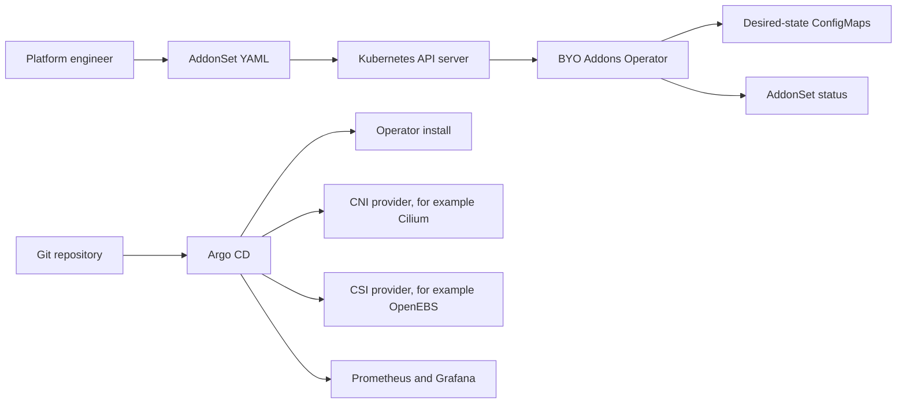

# Bring Your Own Addons

Bring Your Own Addons, or BYO Addons, is a small Kubernetes platform project that demonstrates how a platform team can manage cluster addons in a repeatable, GitOps-friendly way.

In a Kubernetes cluster, an "addon" is a supporting component that makes the cluster usable. Examples include:

- CNI: networking, such as Cilium, Calico, or Flannel.
- CSI: storage, such as OpenEBS, Rook Ceph, or Longhorn.
- GitOps: continuous delivery, such as Argo CD.
- Observability: monitoring and dashboards, such as Prometheus and Grafana.

The main idea of this project is simple: instead of hard-coding one networking tool, one storage tool, and one monitoring stack, the cluster owner describes the desired addon stack in a Kubernetes custom resource named `AddonSet`. The operator watches that resource, records the desired state, and reports status. Argo CD examples in this repo show how the real addons can be synced from Git or Helm charts.

This is a starter platform/operator project, not a finished production addon marketplace. Version `0.1.0` focuses on proving the Kubernetes operator pattern clearly.

## Why This Project Exists

Kubernetes clusters usually need the same supporting services before application teams can deploy safely:

- A network plugin so pods can communicate.
- A storage plugin so workloads can use persistent volumes.
- A GitOps system so cluster changes are applied from Git instead of manually.
- Monitoring so failures can be detected.

Without a system like this, every cluster becomes slightly different. Someone installs Cilium manually, someone else installs OpenEBS differently, and later nobody knows which cluster has which version.

BYO Addons solves that problem by creating a single platform contract:

- The desired addon list is written as YAML.
- The operator watches that YAML through the Kubernetes API.
- The operator stores a normalized desired-state record for each enabled component.
- The status of the `AddonSet` shows whether the desired components were reconciled.
- GitOps manifests show how Argo CD can install the actual addon charts.

The significance of the project is that it demonstrates a real platform engineering pattern:

- custom resources
- reconciliation loops
- finalizers
- status conditions
- RBAC
- Helm packaging
- Kustomize deployment
- Argo CD app-of-apps bootstrap
- Terraform and Ansible bootstrap examples
- Prometheus and Grafana monitoring examples

In an interview, describe it as:

> "I built a Kubernetes operator-based platform starter that lets a cluster owner declare the desired addon stack through an `AddonSet` custom resource. The operator reconciles that resource, records desired state per addon, updates readiness status, and integrates with GitOps examples so Argo CD can install open source providers like Cilium, OpenEBS, and kube-prometheus-stack."

## Current Scope

This project currently does:

- Defines the `AddonSet` custom resource.
- Deploys a Go controller manager.
- Watches `AddonSet` resources.
- Adds a finalizer to each `AddonSet`.
- For each enabled addon component, creates or updates a desired-state `ConfigMap`.
- Updates `AddonSet.status` with component readiness.
- Cleans up owned desired-state `ConfigMap` objects when the `AddonSet` is deleted.
- Provides Helm and Kustomize install options.
- Provides Argo CD `Application` examples for installing the operator and selected addons.
- Provides Terraform and Ansible bootstrap examples.
- Provides Prometheus alert and Grafana dashboard examples.

This project does not yet:

- Automatically install Helm charts directly from the `AddonSet`.
- Automatically generate Argo CD `Application` resources from the `AddonSet`.
- Validate that a selected provider exists in the catalog.
- Check whether Cilium, OpenEBS, or Prometheus are actually healthy.
- Include end-to-end tests against a real `kind` cluster.

Those missing items are good future enhancements and are listed later in this README.

## High-Level Architecture



There are two connected flows:

1. Operator flow: `AddonSet` is applied to Kubernetes, the operator reconciles it, creates desired-state `ConfigMap` objects, and updates status.
2. GitOps flow: Argo CD reads the Git repository and applies the operator chart plus addon charts.

In this starter version, these flows are intentionally separate. The operator records what should exist. Argo CD examples show how actual charts would be installed. A future version can connect them by generating Argo CD `Application` resources directly from the `AddonSet`.

## End-to-End Project Flow

### 1. A platform engineer chooses the addon stack

The sample file is:

```text
config/samples/platform_v1alpha1_addonset.yaml
```

It declares one `AddonSet` named `baseline-oss`:

- cluster name: `dev-kind`
- GitOps engine: `ArgoCD`
- components:
  - `cilium` as the CNI
  - `openebs-localpv` as the CSI
  - `kube-prometheus-stack` as observability

Each component contains:

- `name`: stable internal name
- `type`: category such as `CNI`, `CSI`, or `Observability`
- `provider`: upstream project name
- `version`: desired version
- `namespace`: namespace where it should run
- `enabled`: whether the operator should process it
- `source`: Helm or Git source information
- `values`: provider-specific configuration

### 2. The CRD teaches Kubernetes what an AddonSet is

Kubernetes does not know `AddonSet` by default. The CRD in `config/crd/bases/platform.byoaddons.io_addonsets.yaml` registers the new API:

```text
apiVersion: platform.byoaddons.io/v1alpha1
kind: AddonSet
```

After installing the CRD, you can run:

```bash
kubectl get addonsets
kubectl get aset
```

`aset` works because the CRD defines `aset` as a short name.

### 3. The operator starts as a controller manager

The entrypoint is:

```text
cmd/main.go
```

It:

- creates a Kubernetes runtime scheme
- registers built-in Kubernetes types
- registers the custom `AddonSet` API types
- starts a controller-runtime manager
- configures metrics, health checks, readiness checks, and leader election
- registers the `AddonSetReconciler`

The manager runs in the cluster as a Deployment.

### 4. The reconciler watches AddonSet objects

The main controller logic is:

```text
internal/controller/addonset_controller.go
```

Whenever an `AddonSet` is created, updated, or deleted, Kubernetes notifies the controller. The controller's `Reconcile` function runs.

The reconciliation flow is:

1. Fetch the `AddonSet` from the API server.
2. If it does not exist anymore, ignore the event.
3. If it is not being deleted, add a finalizer.
4. If it is being deleted, delete desired-state `ConfigMap` objects and remove the finalizer.
5. Loop through `spec.components`.
6. Skip disabled components and mark them as disabled in status.
7. For every enabled component, create or update a `ConfigMap`.
8. Update `status.components`.
9. Update `status.readyComponents`, `status.desiredComponents`, and the `Ready` condition.

### 5. Each enabled component becomes a desired-state ConfigMap

For a component named `cilium` inside an `AddonSet` named `baseline-oss`, the operator creates:

```text
baseline-oss-cilium-desired
```

The `ConfigMap` contains:

- `addon.json`: JSON representation of the component
- `engine`: GitOps engine, for example `ArgoCD`
- `cluster`: cluster name, for example `dev-kind`

The `ConfigMap` is not the final addon installation. It is a normalized record saying:

> "This is the desired addon component that the platform wants for this cluster."

### 6. Status explains what happened

After reconciliation, this command shows the object summary:

```bash
kubectl get addonsets -n byo-addons-system
```

You should see columns similar to:

```text
NAME           CLUSTER    DESIRED   READY
baseline-oss   dev-kind   3         3
```

For more detail:

```bash
kubectl describe addonset baseline-oss -n byo-addons-system
kubectl get addonset baseline-oss -n byo-addons-system -o yaml
```

The status tells you:

- how many enabled components were desired
- how many were reconciled
- whether the `Ready` condition is true
- where each component was recorded

### 7. Argo CD examples install real addons

The files in `gitops/argocd/applications/` are Argo CD `Application` examples.

They are separate from the operator. They show how a GitOps controller could install:

- the BYO Addons operator
- Cilium
- OpenEBS
- kube-prometheus-stack

The root application uses the app-of-apps pattern:

```text
gitops/argocd/applications/byo-addons-root.yaml
```

It points Argo CD at the `gitops/argocd/applications` folder so Argo CD can create the child applications.

## Setup From Zero

### Prerequisites

Install the tools you need:

```bash
brew install go helm kustomize terraform ansible kubectl
```

Optional but useful:

```bash
brew install kind argocd
go install sigs.k8s.io/controller-tools/cmd/controller-gen@latest
```

You need access to a Kubernetes cluster through your current kubeconfig:

```bash
kubectl cluster-info
kubectl get nodes
```

For local testing, create a small `kind` cluster:

```bash
kind create cluster --name byo-addons
```

### Local Development Setup

Download Go dependencies:

```bash
go mod download
```

Format, vet, and test:

```bash
make test
```

Build the manager binary:

```bash
make build
```

Render all install manifests locally:

```bash
make render
```

`make render` writes rendered output to `/tmp/byo-addons-kustomize.yaml` and `/tmp/byo-addons-helm.yaml`. This is useful for checking what Kubernetes YAML would be applied before applying it.

### Install With Kustomize

Install only the CRD:

```bash
make install
```

Deploy the operator:

```bash
make deploy
```

Apply the sample `AddonSet`:

```bash
kubectl apply -f config/samples/platform_v1alpha1_addonset.yaml
```

Check the result:

```bash
kubectl get addonsets -n byo-addons-system
kubectl get configmaps -n kube-system -l platform.byoaddons.io/managed-by=byo-addons-operator
kubectl get configmaps -n openebs -l platform.byoaddons.io/managed-by=byo-addons-operator
kubectl get configmaps -n monitoring -l platform.byoaddons.io/managed-by=byo-addons-operator
```

Remove the operator:

```bash
make undeploy
```

### Install With Helm

Install the operator chart:

```bash
helm upgrade --install byo-addons charts/byo-addons-operator \
  --namespace byo-addons-system \
  --create-namespace \
  --include-crds
```

Install the operator and also create the sample `AddonSet`:

```bash
helm upgrade --install byo-addons charts/byo-addons-operator \
  --namespace byo-addons-system \
  --create-namespace \
  --include-crds \
  --set sampleAddonSet.enabled=true \
  --set sampleAddonSet.clusterName=dev-kind
```

Check the Deployment:

```bash
kubectl get deploy -n byo-addons-system
kubectl logs -n byo-addons-system deploy/byo-addons-byo-addons-operator
```

The exact Deployment name can change depending on the Helm release name. Use `kubectl get deploy -n byo-addons-system` if the log command name differs.

## GitOps Bootstrap With Argo CD

Argo CD should already be installed, or you can use the Terraform example to install it.

Apply the Argo CD project:

```bash
kubectl apply -f gitops/argocd/projects/byo-addons.yaml
```

Apply the root application:

```bash
kubectl apply -f gitops/argocd/applications/byo-addons-root.yaml
```

Argo CD will read child applications from:

```text
gitops/argocd/applications
```

The child apps include:

- `byo-addons-operator.yaml`
- `oss-cni-cilium.yaml`
- `oss-csi-openebs.yaml`
- `observability-kube-prometheus-stack.yaml`

Important: before using GitOps with your own repository, replace every `https://github.com/example/byo-addons.git` value with your real repository URL.

Example:

```yaml
repoURL: https://github.com/your-username/byo-addons.git
```

Also update `gitops/argocd/projects/byo-addons.yaml` so your real repo is allowed in `sourceRepos`.

## Terraform Bootstrap

The Terraform example is in:

```text
infra/terraform/kind
```

It:

- reads your kubeconfig
- creates the `argocd` namespace
- creates the `byo-addons-system` namespace
- creates the `monitoring` namespace
- optionally installs Argo CD with Helm

Run:

```bash
cd infra/terraform/kind
terraform init
terraform apply
```

Useful variables:

- `kubeconfig_path`: kubeconfig path, default `~/.kube/config`
- `argocd_namespace`: namespace for Argo CD, default `argocd`
- `install_argocd`: whether Terraform installs Argo CD, default `true`

If Argo CD is already installed, create a `terraform.tfvars` file:

```hcl
install_argocd = false
```

`terraform.tfvars` is ignored by Git because it is local environment state.

## Ansible Bootstrap

The Ansible example is in:

```text
infra/ansible
```

Install the required Ansible collection:

```bash
ansible-galaxy collection install -r infra/ansible/requirements.yml
```

Run the playbook:

```bash
ansible-playbook -i infra/ansible/inventory.ini infra/ansible/bootstrap.yml
```

It:

- creates the required namespaces
- applies the Argo CD `AppProject`
- applies the root Argo CD `Application`

Use Terraform when you want infrastructure-style provisioning. Use Ansible when you want a repeatable operational bootstrap playbook.

## Placeholder Values To Replace

This repo contains several placeholder values because it is a starter/template project.

There is no literal `[example.com]` placeholder in this repo, but there are `github.com/example/...`, `https://github.com/example/...`, and `ghcr.io/example/...` placeholders. They exist because the project was scaffolded as a reusable starter. Before using it as your own project, replace them with your real GitHub organization/user, repository name, and container registry.

| Placeholder | Where it appears | Why it exists | Replace with |
| --- | --- | --- | --- |
| `github.com/example/byo-addons` | `go.mod`, Go imports, `PROJECT` | Temporary Go module path | Your real Go module path, usually `github.com/<user-or-org>/<repo>` |
| `https://github.com/example/byo-addons.git` | Argo CD application files and project file | Temporary Git repo URL | Your real Git repository URL |
| `ghcr.io/example/byo-addons-operator` | `Makefile`, Kustomize image config, Helm values | Temporary container image location | Your real image registry, for example `ghcr.io/<user-or-org>/byo-addons-operator` |
| `example` in chart `home` | `charts/byo-addons-operator/Chart.yaml` | Temporary project homepage | Your real repository or documentation URL |
| `dev-kind` | sample `AddonSet`, Helm sample values, GitOps sample values | Local development cluster name | Your target cluster name, for example `dev`, `stage`, or `prod-us-east` |
| addon versions like `1.15.x`, `4.x`, `60.x` | sample addon sources | Version ranges for examples | Exact versions approved by your team |

If you change the Go module path, update imports consistently:

```bash
go mod edit -module github.com/your-username/byo-addons
```

Then replace import paths in Go files from:

```text
github.com/example/byo-addons
```

to:

```text
github.com/your-username/byo-addons
```

After changing module paths, run:

```bash
go mod tidy
make test
```

## Repository Layout

```text
.
├── addons/                  Curated addon provider catalog examples
├── api/                     Go API types for the AddonSet CRD
├── charts/                  Helm chart for installing the operator
├── cmd/                     Operator manager entrypoint
├── config/                  Kustomize manifests for CRD, RBAC, manager, samples
├── docs/                    Extra architecture and versioning notes
├── gitops/                  Argo CD AppProject and Application examples
├── infra/                   Terraform and Ansible bootstrap examples
├── internal/                Controller reconciliation logic
├── monitoring/              PrometheusRule and Grafana dashboard examples
├── Dockerfile               Container image build for the operator
├── Makefile                 Common development and deployment commands
├── PROJECT                  Kubebuilder project metadata
├── VERSION                  Current project version
├── go.mod                   Go module definition
└── go.sum                   Go dependency checksums
```

## File-by-File Explanation

### Root Files

| File | Purpose |
| --- | --- |
| `.gitignore` | Ignores local build output, Terraform state, kubeconfig files, IDE folders, and caches. |
| `Dockerfile` | Builds the Go manager binary in a `golang:1.22` builder image, then copies it into a small distroless runtime image. |
| `LICENSE` | Project license. |
| `Makefile` | Provides common commands like `make test`, `make deploy`, `make install`, and `make render`. |
| `PROJECT` | Kubebuilder metadata describing the domain, repo path, layout, and API resource. |
| `README.md` | Main documentation for understanding, installing, and explaining the project. |
| `VERSION` | Current version, currently `0.1.0`. |
| `go.mod` | Defines the Go module and dependencies such as Kubernetes API libraries and controller-runtime. |
| `go.sum` | Records dependency checksums for reproducible Go builds. |

### API Files

| File | Purpose |
| --- | --- |
| `api/v1alpha1/addonset_types.go` | Defines the `AddonSet` spec and status Go structs. Kubebuilder comments in this file generate CRD schema, validation, status subresource, and kubectl print columns. |
| `api/v1alpha1/groupversion_info.go` | Registers the API group `platform.byoaddons.io` and version `v1alpha1` with the runtime scheme. |
| `api/v1alpha1/zz_generated.deepcopy.go` | Generated deep-copy functions needed by Kubernetes runtime machinery. Do not edit manually. Regenerate with `controller-gen`. |

### Controller Files

| File | Purpose |
| --- | --- |
| `cmd/main.go` | Starts the controller manager, registers schemes, configures health and readiness probes, metrics, leader election, and the `AddonSet` reconciler. |
| `internal/controller/addonset_controller.go` | Main business logic. Watches `AddonSet`, creates desired-state `ConfigMap` objects, updates status, and handles finalizer cleanup. |

### Kustomize Config Files

| File | Purpose |
| --- | --- |
| `config/crd/bases/platform.byoaddons.io_addonsets.yaml` | Generated CRD manifest installed into the cluster. |
| `config/crd/kustomization.yaml` | Kustomize entry for CRDs. |
| `config/default/kustomization.yaml` | Main Kustomize deployment entry. Includes CRD, RBAC, and manager manifests. Also sets the default operator image. |
| `config/manager/manager.yaml` | Namespace, Deployment, and metrics Service for the operator manager. |
| `config/manager/kustomization.yaml` | Kustomize entry for manager resources. |
| `config/prometheus/kustomization.yaml` | Kustomize entry for ServiceMonitor resources. |
| `config/prometheus/monitor.yaml` | ServiceMonitor for Prometheus Operator to scrape controller metrics. Requires Prometheus Operator CRDs. |
| `config/rbac/service_account.yaml` | ServiceAccount used by the operator pod. |
| `config/rbac/role.yaml` | ClusterRole allowing the operator to manage `AddonSet`, status, finalizers, ConfigMaps, and events. |
| `config/rbac/role_binding.yaml` | Binds the manager ClusterRole to the operator ServiceAccount. |
| `config/rbac/leader_election_role.yaml` | Role allowing leader-election lease access. |
| `config/rbac/leader_election_role_binding.yaml` | Binds the leader-election Role to the operator ServiceAccount. |
| `config/rbac/kustomization.yaml` | Kustomize entry for RBAC resources. |
| `config/samples/platform_v1alpha1_addonset.yaml` | Example `AddonSet` that declares Cilium, OpenEBS, and kube-prometheus-stack. |

### Helm Chart Files

| File | Purpose |
| --- | --- |
| `charts/byo-addons-operator/Chart.yaml` | Helm chart metadata: name, version, app version, description, keywords, and homepage. |
| `charts/byo-addons-operator/values.yaml` | Default configurable values for image, replica count, leader election, metrics, resources, and sample `AddonSet`. |
| `charts/byo-addons-operator/crds/platform.byoaddons.io_addonsets.yaml` | CRD shipped with the Helm chart. Installed when using `--include-crds`. |
| `charts/byo-addons-operator/templates/_helpers.tpl` | Helm helper templates for names, labels, namespaces, and service account naming. |
| `charts/byo-addons-operator/templates/deployment.yaml` | Operator Deployment template. |
| `charts/byo-addons-operator/templates/service.yaml` | Metrics Service template. |
| `charts/byo-addons-operator/templates/serviceaccount.yaml` | ServiceAccount template. |
| `charts/byo-addons-operator/templates/rbac.yaml` | ClusterRole, ClusterRoleBinding, leader-election Role, and RoleBinding templates. |
| `charts/byo-addons-operator/templates/servicemonitor.yaml` | Optional ServiceMonitor template, enabled through Helm values. |
| `charts/byo-addons-operator/templates/sample-addonset.yaml` | Optional sample `AddonSet`, enabled with `sampleAddonSet.enabled=true`. |

### GitOps Files

| File | Purpose |
| --- | --- |
| `gitops/argocd/projects/byo-addons.yaml` | Argo CD `AppProject` that allows this repo and supported Helm repositories as sources. |
| `gitops/argocd/applications/byo-addons-root.yaml` | Root app-of-apps Argo CD `Application`. It points to the applications folder and excludes itself. |
| `gitops/argocd/applications/byo-addons-operator.yaml` | Argo CD app that installs the BYO Addons operator Helm chart from this repo. |
| `gitops/argocd/applications/oss-cni-cilium.yaml` | Argo CD app that installs Cilium from the Cilium Helm repository. |
| `gitops/argocd/applications/oss-csi-openebs.yaml` | Argo CD app that installs OpenEBS from the OpenEBS Helm repository. |
| `gitops/argocd/applications/observability-kube-prometheus-stack.yaml` | Argo CD app that installs kube-prometheus-stack. |

### Addon Catalog Files

| File | Purpose |
| --- | --- |
| `addons/catalog/kustomization.yaml` | Kustomize entry for addon provider catalog ConfigMaps. |
| `addons/catalog/cni/catalog.yaml` | Catalog of open source CNI providers: Cilium, Calico OSS, and Flannel. |
| `addons/catalog/csi/catalog.yaml` | Catalog of open source CSI providers: OpenEBS, Rook Ceph, Longhorn, and democratic-csi. |
| `addons/catalog/observability/catalog.yaml` | Catalog of observability providers: kube-prometheus-stack and Loki. |

The current operator does not enforce this catalog yet. It is reference data for future validation and UI/API workflows.

### Infrastructure Files

| File | Purpose |
| --- | --- |
| `infra/terraform/kind/versions.tf` | Required Terraform version and provider versions. |
| `infra/terraform/kind/variables.tf` | Terraform variables for kubeconfig path, Argo CD namespace, and whether to install Argo CD. |
| `infra/terraform/kind/main.tf` | Creates namespaces and optionally installs Argo CD through Helm. |
| `infra/terraform/kind/outputs.tf` | Prints useful namespace outputs after Terraform apply. |
| `infra/ansible/inventory.ini` | Local Ansible inventory using `localhost`. |
| `infra/ansible/requirements.yml` | Requires the `kubernetes.core` Ansible collection. |
| `infra/ansible/bootstrap.yml` | Creates namespaces and applies the Argo CD project plus root application. |

### Monitoring Files

| File | Purpose |
| --- | --- |
| `monitoring/kustomization.yaml` | Kustomize entry for monitoring resources. |
| `monitoring/prometheus/byo-addons-rules.yaml` | Prometheus alerts for operator scrape failure and reconciliation errors. |
| `monitoring/grafana/dashboards/byo-addons-dashboard-configmap.yaml` | Grafana dashboard ConfigMap with panels for reconcile errors, reconcile duration, and queue depth. |

### Documentation Files

| File | Purpose |
| --- | --- |
| `docs/architecture.md` | Short architecture notes. |
| `docs/versioning.md` | Semantic versioning and branching guidance. |

## Important Code Concepts

### Custom Resource Definition

The CRD lets Kubernetes store and validate a new resource type. In this project, that resource is `AddonSet`.

The Go structs in `api/v1alpha1/addonset_types.go` are the source of truth for the CRD. Kubebuilder markers such as `+kubebuilder:validation:Enum` and `+kubebuilder:subresource:status` generate Kubernetes schema behavior.

### Reconciliation

Reconciliation means the controller repeatedly tries to make the real cluster match the desired state.

In this project:

- desired state is `AddonSet.spec`
- observed state is whether desired-state `ConfigMap` objects exist
- output state is `AddonSet.status`

The reconcile function is idempotent. Running it multiple times should produce the same final state.

### Finalizer

A finalizer delays deletion until cleanup is done.

This project adds:

```text
addonset.platform.byoaddons.io/finalizer
```

When an `AddonSet` is deleted, the operator deletes the desired-state `ConfigMap` objects first, then removes the finalizer. After that, Kubernetes can finish deleting the `AddonSet`.

### Owner Reference

The controller sets the `AddonSet` as the owner of each desired-state `ConfigMap`. This helps Kubernetes understand the relationship between objects and allows the controller to watch owned ConfigMaps.

### Status Conditions

The operator writes a `Ready` condition. If all enabled components were reconciled, the condition is true with reason `ComponentsReconciled`. Otherwise it is false with reason `ComponentsPending`.

## How To Use The Project In Practice

For local learning:

1. Create a local cluster with `kind`.
2. Run `make install`.
3. Run `make deploy`.
4. Apply `config/samples/platform_v1alpha1_addonset.yaml`.
5. Inspect `AddonSet.status`.
6. Inspect the generated desired-state `ConfigMap` objects.

For GitOps-style usage:

1. Push this repo to your own GitHub account or organization.
2. Replace all placeholder repository URLs.
3. Replace the image repository with your own published operator image.
4. Install Argo CD.
5. Apply `gitops/argocd/projects/byo-addons.yaml`.
6. Apply `gitops/argocd/applications/byo-addons-root.yaml`.
7. Let Argo CD sync the operator and addon applications.

For production extension:

1. Add validation against the provider catalog.
2. Generate Argo CD `Application` resources from `AddonSet.spec.components`.
3. Add health checks for real workloads.
4. Add tests and e2e validation.
5. Add environment overlays for dev, staging, and production.

## What Each Make Command Does

| Command | Meaning |
| --- | --- |
| `make help` | Lists available Make targets. |
| `make fmt` | Runs `go fmt ./...`. |
| `make vet` | Runs `go vet ./...`. |
| `make test` | Runs formatting, vetting, and Go tests. |
| `make manifests` | Regenerates CRDs and RBAC if `controller-gen` is installed. Otherwise it uses checked-in manifests. |
| `make build` | Builds the operator binary at `bin/manager`. |
| `make docker-build` | Builds the operator container image using `Dockerfile`. |
| `make install` | Builds CRD YAML with Kustomize and applies it to the current cluster. |
| `make deploy` | Builds the full Kustomize install and applies it to the current cluster. |
| `make undeploy` | Deletes the full Kustomize install from the current cluster. |
| `make helm-lint` | Validates the Helm chart. |
| `make render` | Renders Kustomize and Helm YAML locally into `/tmp`. |

## Common Troubleshooting

### `kubectl get addonsets` says the resource does not exist

The CRD is not installed. Run:

```bash
make install
```

### The operator pod cannot pull the image

The default image is:

```text
ghcr.io/example/byo-addons-operator:0.1.0
```

That is a placeholder. Build and push your own image, then update:

- `Makefile`
- `config/default/kustomization.yaml`
- `charts/byo-addons-operator/values.yaml`
- `gitops/argocd/applications/byo-addons-operator.yaml` if you override values there

### Argo CD cannot access the repo

Replace:

```text
https://github.com/example/byo-addons.git
```

with your real repo URL in:

- `gitops/argocd/projects/byo-addons.yaml`
- `gitops/argocd/applications/byo-addons-root.yaml`
- `gitops/argocd/applications/byo-addons-operator.yaml`

### No actual Cilium or OpenEBS pods appear after applying AddonSet

That is expected in version `0.1.0`. The operator records desired state; it does not directly install those addons yet.

To install real addons, use the Argo CD application manifests or install the Helm charts manually.

### ServiceMonitor or PrometheusRule fails to apply

Those resources require Prometheus Operator CRDs. Install kube-prometheus-stack first, or skip the monitoring manifests.

## Interview Explanation

Use this structure when explaining the project:

1. Problem:
   Kubernetes clusters need networking, storage, GitOps, and monitoring. Installing those manually makes clusters inconsistent.

2. Solution:
   This project creates a Kubernetes operator with a custom resource called `AddonSet`. The `AddonSet` is a declarative contract for the desired addon stack.

3. How it works:
   The CRD registers `AddonSet` with Kubernetes. The controller manager runs in the cluster. The reconciler watches `AddonSet` objects. For each enabled component, it records desired state in a ConfigMap and updates status. A finalizer cleans up those records on deletion.

4. GitOps integration:
   Argo CD manifests show how the operator and real addon Helm charts can be synced from Git. The root app uses app-of-apps to create child apps.

5. Packaging:
   The operator can be installed with Kustomize or Helm. The Dockerfile builds the controller image.

6. Observability:
   The project includes metrics scraping configuration, Prometheus alerts, and a Grafana dashboard starter.

7. Limitations:
   The current version does not directly install Helm charts from the `AddonSet`. That is intentionally left as the next step so the base operator pattern stays simple and understandable.

8. Future work:
   Generate Argo CD `Application` resources from `AddonSet`, validate providers against the catalog, add addon health checks, and add e2e tests with `kind`.

Short interview version:

> "BYO Addons is a Kubernetes platform operator. It defines an `AddonSet` CRD where a cluster owner declares required addons like CNI, CSI, and observability. The controller watches those resources, uses a reconciliation loop to create desired-state records, updates status conditions, and cleans up with a finalizer. The repo also includes Helm, Kustomize, Argo CD, Terraform, Ansible, and monitoring examples so the operator can fit into a real GitOps-based platform workflow."

## Future Enhancements

- Generate Argo CD `Application` resources from `AddonSet.spec.components`.
- Add admission validation so only approved provider catalog entries are allowed.
- Add health checks that inspect real Deployments, DaemonSets, StorageClasses, and Services.
- Add e2e tests against a local `kind` cluster.
- Add environment overlays for `dev`, `stage`, and `prod`.
- Add support for Flux as another GitOps engine.
- Add documentation for building and pushing the operator image in CI.

## Versioning

This project uses semantic versioning.

Current version:

```text
0.1.0
```

The version appears in:

- `VERSION`
- `charts/byo-addons-operator/Chart.yaml`
- `Makefile`
- `config/default/kustomization.yaml`
- `charts/byo-addons-operator/values.yaml`

See `docs/versioning.md` for release guidance.
